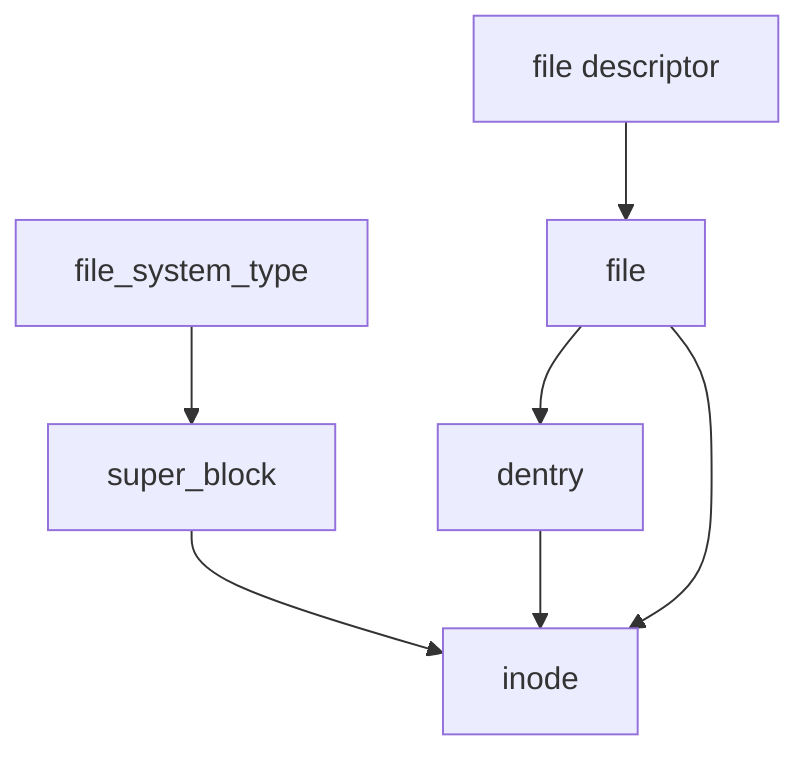
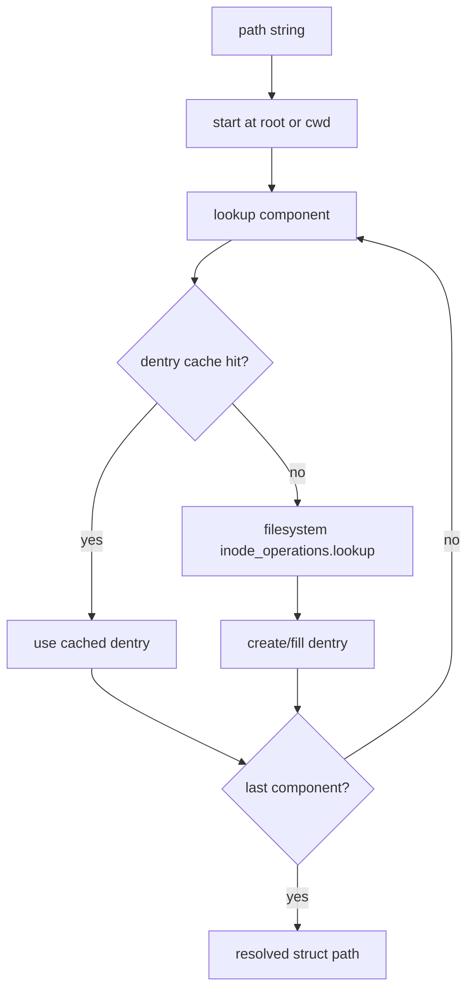
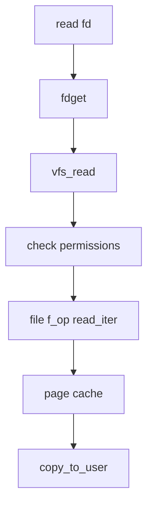
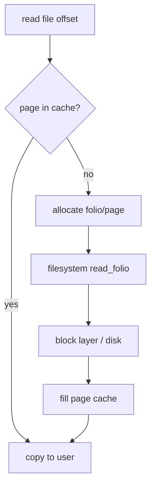
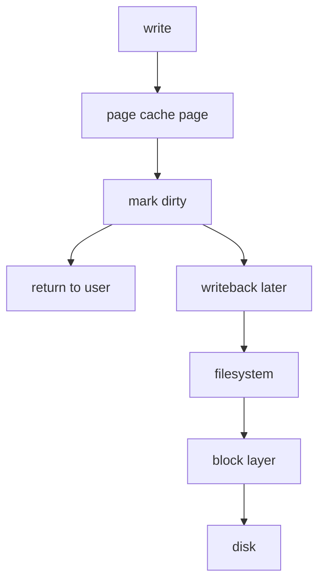

# VFS в Linux

Virtual File System  
Курс: Ядро Linux

---

# Вопрос

```text
Как Linux работает с файлами?
```

---

# Главная идея VFS

**VFS** — это слой абстракции, который позволяет разным файловым системам выглядеть для user space одинаково.

```text
ext4 (Файл на жёстком диске)
tmpfs (Временная ФС)
procfs (Псевдофайлы)
sysfs (Псевдофайлы)
NFS (Файлы по сети)
FUSE (Файлы через пользовательский код)
```

Все они доступны через общий интерфейс:

```text
open()
read()
write()
close()
```

---

# Главная идея VFS

User space не знает, какая файловая система под ним.

```c
int fd = open("file.txt", O_RDONLY);
read(fd, buf, size);
close(fd);
```

Это может быть:

- ext4 на диске
- tmpfs в RAM
- procfs-псевдофайл
- файл на NFS
- device node

---

# VFS как прослойка

```text
User space
    ↓
syscalls: open/read/write/stat
    ↓
VFS
    ↓
filesystem implementation
    ↓
block layer / network / memory / driver
```

---

# Место VFS в ядре

VFS связывает несколько подсистем:

- syscall layer
- process file descriptor table
- path lookup
- page cache
- конкретные файловые системы
- block layer
- device drivers

---

# Основные объекты VFS

Пять важных объектов:

```text
file_system_type
super_block
inode
dentry
file
```

---

# Схема объектов



---

# `file_system_type`

Описывает тип файловой системы.

Например:

```text
ext4
tmpfs
proc
sysfs
```

---

# `super_block`

Описывает конкретный экземпляр смонтированной файловой системы.

Например:

```text
/dev/sda1 mounted as ext4 at /
```

Для него создаётся свой `struct super_block`.

---

# `super_block`

Содержит (но не только):

- размер блока
- magic number
- root dentry
- super_operations
- список inode
- filesystem-private data

Файл:

```text
include/linux/fs.h
```
--
# `super_block`
## Размер блока
Размер минимальной единицы I/O для файловой системы
```c
unsigned long s_blocksize;
unsigned char s_blocksize_bits;
```
--
# `super_block`
## Magic number
Уникальный идентификатор типа файловой системы
```c
unsigned long s_magic;
```
Например:
```c
EXT4_SUPER_MAGIC = 0xEF53
TMPFS_MAGIC      = 0x01021994
PROC_SUPER_MAGIC = 0x9fa0
```
--
# `super_block`
## root dentry
Указатель на супер-блок корня ФС
```c
struct dentry *s_root;
```
--
# `super_block`
## Список inode
Все inode, этой FS
```c
struct list_head s_inodes;
```
--
# `super_block`
## filesystem-private data
Специфичные для конкретной ФС данные
```c
void *s_fs_info;
```
---

# `inode`

`inode` — это объект файла как сущности файловой системы.

Он содержит метаданные:

- тип файла
- права
- владелец
- размер
- timestamps
- ссылки на операции
--
# `inode`
## Ссылки (указатели) на операции

```c
struct inode {
...
const struct inode_operations *i_op;
const struct file_operations  *i_fop;
...
};
```
Пример использования:
```c
inode->i_op->lookup(...)
inode->i_op->mkdir(...)
```

---

# Важный момент

`inode` — это **не имя файла**.

Один inode может иметь несколько имён:

```text
hard links
```

Поэтому имя и inode — разные сущности.

---

# `dentry`

`dentry` — это объект имени в дереве каталогов.

Он связывает:

```text
имя + parent directory → inode
```

Пример:

```text
/home/user/file.txt
```

Каждый компонент пути связан с dentry.

---

# Почему dentry нужен

Path lookup дорогой.

Поэтому ядро кэширует результаты разрешения имён:

```text
dentry cache
```

Это ускоряет повторные обращения к файлам.

---

# Negative dentry

Negative dentry — это кэшированный результат:

```text
"такого файла здесь нет"
```

Повторные lookup для отсутствующего файла не идут в файловую систему.

---

# `file`

`struct file` — это **открытый файл**.

Он создаётся при `open()`.

Важно:

```text
inode = объект файла
dentry = имя файла
file = открытая сессия доступа
fd = номер в таблице процесса
```

---

# `file` хранит

- текущую позицию `f_pos`
- flags (`O_RDONLY`, `O_APPEND`, ...)
- указатель на `file_operations`
- ссылку на path
- private data

---

# fd vs struct file

```text
fd = int в user space
struct file = объект ядра
```

Процесс хранит таблицу fd:

```text
task_struct
  ↓
files_struct
  ↓
fdtable
  ↓
struct file *
```

---

# Схема fd → file → inode


---

# Пример: два fd на один inode

```c
int fd1 = open("a.txt", O_RDONLY);
int fd2 = open("a.txt", O_RDONLY);
```

Будет:

```text
2 разных struct file
1 общий dentry/inode
```

Позиция чтения у `fd1` и `fd2` независимая.

---

# Пример: dup()

```c
int fd1 = open("a.txt", O_RDONLY);
int fd2 = dup(fd1);
```

Будет:

```text
2 fd
1 общий struct file
```

Позиция чтения общая.

---

# Пример: dup()

```c
read(fd1, buf, 10);
read(fd2, buf, 10);
```

Если `fd2 = dup(fd1)`, второй read продолжит с новой позиции.

Если `fd2 = open(...)`, позиция будет независимой.

---

# VFS операции

Основные таблицы операций:

```text
file_operations
inode_operations
super_operations
address_space_operations
```

---

# `file_operations`

Операции над открытым файлом:

```c
struct file_operations {
    ssize_t (*read_iter)(...);
    ssize_t (*write_iter)(...);
    int (*open)(...);
    int (*release)(...);
    long (*unlocked_ioctl)(...);
    ...
};
```

---

# `inode_operations`

Операции уровня inode / directory:

```c
struct inode_operations {
    struct dentry *(*lookup)(...);
    int (*create)(...);
    int (*mkdir)(...);
    int (*unlink)(...);
    int (*rename)(...);
    ...
};
```

---

# `super_operations`

Операции над whole filesystem instance:

```c
struct super_operations {
    void (*put_super)(...);
    int (*statfs)(...);
    void (*evict_inode)(...);
    ...
};
```

---

# `address_space_operations`

Связь с page cache.

Типичные операции:

```text
read_folio
writepages
dirty_folio
```

Через них filesystem участвует в page cache / writeback pipeline.

---

# Path lookup

Когда программа делает:

```c
open("/home/user/file.txt", O_RDONLY);
```

ядро должно пройти путь:

```text
/
home
user
file.txt
```

---

# Path lookup: идея

Для каждого компонента:

```text
найти dentry
если нет в dcache:
    вызвать filesystem lookup()
получить inode
перейти дальше
```

---

# Path lookup pipeline



---

# `struct path`

В ядре путь часто представлен как:

```c
struct path {
    struct vfsmount *mnt;
    struct dentry *dentry;
};
```

То есть это не просто строка.

Это пара:

```text
mount + dentry
```

---

# Почему нужен mount

Один и тот же dentry без mount не всегда полностью описывает путь.

Потому что в Linux есть единое дерево монтирования:

```text
/
├── home
├── proc
├── sys
└── mnt
```

---

# Mount point

Когда одна файловая система монтируется поверх каталога другой:

```bash
mount /dev/sdb1 /mnt/data
```

VFS при path lookup должен пересекать mount boundary.

---

# open(): общий путь

```text
open()
  ↓
sys_openat()
  ↓
do_sys_openat2()
  ↓
do_filp_open()
  ↓
path lookup
  ↓
vfs_open()
  ↓
file_operations.open()
  ↓
fd_install()
```

---

# Где смотреть open()

Файлы:

```text
fs/open.c
fs/namei.c
fs/file.c
```

Ключевые идеи:

- выделить fd
- разрешить path
- создать `struct file`
- связать fd → file

---

# open():

```c
fd = get_unused_fd_flags(flags);
file = do_filp_open(...);
fd_install(fd, file);
return fd;
```

Это не точная копия кода, а лишь примерная схема

---

# read(): общий путь

```text
read(fd, buf, count)
  ↓
syscall
  ↓
ksys_read()
  ↓
vfs_read()
  ↓
file->f_op->read_iter()
  ↓
filesystem / page cache
```

---

# Где смотреть read()

Файл:

```text
fs/read_write.c
```

Ключевые функции:

```text
ksys_read()
vfs_read()
new_sync_read()
```

---

# read(): схема



---

# write(): общий путь

```text
write(fd, buf, count)
  ↓
ksys_write()
  ↓
vfs_write()
  ↓
file->f_op->write_iter()
  ↓
page cache dirty page
  ↓
writeback later
```

---

# Где смотреть write()

Файл:

```text
fs/read_write.c
```

Ключевые функции:

```text
ksys_write()
vfs_write()
new_sync_write()
```

---

# Page cache в VFS

VFS тесно связан с page cache.

Для обычного файла:

```text
read()
  ↓
page cache hit?
  yes → copy from memory
  no  → filesystem reads from disk into page cache
```

---

# File data и address_space

У inode есть mapping:

```c
struct address_space *i_mapping;
```

Это объект, связывающий файл с page cache.

---

# Page cache pipeline



---

# Writeback pipeline



---

# Почему write() может вернуться до записи на диск

Обычно `write()` пишет в page cache и помечает страницы dirty.

Физическая запись на диск может произойти позже.

Для принудительной синхронизации:

```c
fsync(fd);
```

---

# `fsync()`

```text
flush dirty pages to storage
```

Это важно для:

- баз данных
- журналов
- критичных данных

---

# Пример: procfs

`procfs` — это файловая система, но не обычная.

```text
/proc/meminfo
/proc/<pid>/status
```

Эти “файлы” генерируются ядром.

---

# Почему procfs хорош для обучения

Он показывает:

```text
файл не обязан быть данными на диске
```

Файл может быть интерфейсом к структурам ядра.

---

# Пример: простой procfs module

```c
static int show(struct seq_file *m, void *v)
{
    seq_printf(m, "hello from kernel\n");
    return 0;
}

static int open(struct inode *inode, struct file *file)
{
    return single_open(file, show, NULL);
}
```

---

# procfs operations

```c
static const struct proc_ops ops = {
    .proc_open = open,
    .proc_read = seq_read,
    .proc_lseek = seq_lseek,
    .proc_release = single_release,
};
```

---

# Создание procfs entry

```c
proc_create("vfs_demo", 0444, NULL, &ops);
```

После загрузки модуля:

```bash
cat /proc/vfs_demo
```

---

# Character device и VFS

Char device тоже проходит через VFS.

```text
open("/dev/mydev")
  ↓
VFS
  ↓
inode says: character device
  ↓
driver file_operations
```

---

# Связь с ioctl

`ioctl()` тоже идёт через `struct file_operations`.

```c
.unlocked_ioctl = my_ioctl
```

То есть `ioctl` — часть VFS/device interface.

---

# “Everything is a file”

Это не буквально “всё файл на диске”.

Это значит:

```text
многие ресурсы представлены через файловый интерфейс
```

Например:

- regular files
- directories
- devices
- pipes
- sockets
- procfs/sysfs nodes

---

# Где ломается абстракция

Не всё одинаково:

- regular file
- directory
- socket
- pipe
- block device
- char device
- procfs file

У них разные `file_operations`.

---

# Что посмотреть в ядре

Основные файлы:

```text
include/linux/fs.h
fs/open.c
fs/read_write.c
fs/namei.c
fs/file.c
mm/filemap.c
```

---

# Reading Quest

Найти:

1. `struct file`
2. `struct inode`
3. `struct dentry`
4. `struct super_block`
5. `vfs_read()`
6. `vfs_write()`
7. где fd превращается в `struct file *`
8. где path превращается в dentry/inode

---

# Мини-разбор: fdget()

При `read(fd, ...)` ядру нужно получить объект `struct file`.

Концептуально:

```text
fd
  ↓
current->files
  ↓
fdtable
  ↓
struct file *
```

---

# Мини-разбор: path lookup

При `open("/a/b/c")` ядро:

```text
берёт root
ищет a
ищет b
ищет c
получает dentry + inode
```

Если dentry уже в dcache — быстрее.

---

# Мини-разбор: vfs_read()

VFS делает:

- проверку, можно ли читать
- проверку user buffer
- обновление позиции
- вызов конкретной реализации чтения

---

# Мини-разбор: file_operations

Главная идея polymorphism в C:

```c
file->f_op->read_iter(...)
```

VFS не знает заранее,
что это за filesystem или device.

Он вызывает функцию из таблицы операций.

---

# Вопросы для самопроверки

Почему `read()` для обычного файла,
`read()` для pipe,
и `read()` для `/proc/meminfo`
могут иметь совершенно разную реализацию?

--

# Ответ

Потому что у них разные:

```text
struct file_operations
```

Но syscall-интерфейс одинаковый.

---

# Ещё вопрос

Почему `inode` не равен `file`?

--

# Ответ

Потому что:

```text
inode = объект файла
file = открытый экземпляр
```

Один inode может быть открыт много раз.

---

# Ещё вопрос

Почему `dentry` не равен `inode`?

--

# Ответ

Потому что:

```text
dentry = имя в дереве каталогов
inode = объект файловой системы
```

Hard link:

```text
несколько dentry → один inode
```

---

# Итог

Сегодня мы разобрали:

- зачем нужен VFS
- `super_block`, `inode`, `dentry`, `file`
- path lookup
- fd table
- open/read/write pipeline
- связь VFS с page cache
- procfs и device files
- где читать код ядра

---

# Следующая лекция

Block layer и ввод-вывод

---

# Источники

- Linux kernel documentation: Overview of the Linux Virtual File System
- Linux kernel documentation: Pathname lookup
- Linux kernel documentation: Filesystems API summary
